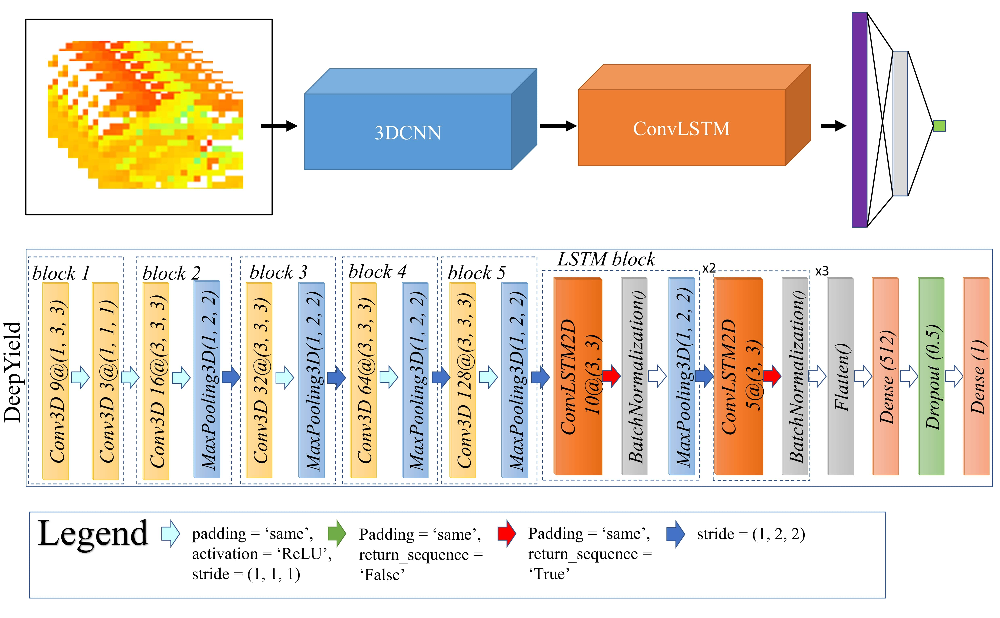
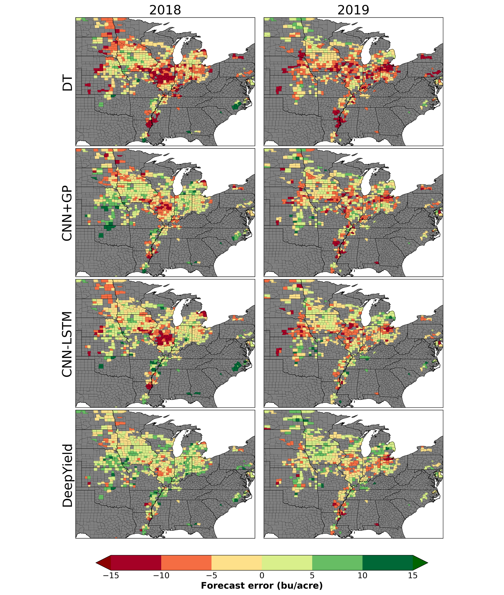
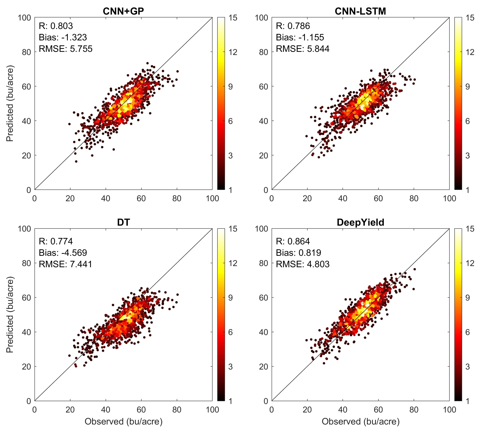

# DeepYield

 This repository contains codes for the paper entitled <a href="https://www.sciencedirect.com/science/article/pii/S0957417421009210" target="_blank">"DeepYield: A combined convolutional neural network with long short-term memory for crop yield forecasting"</a> published in Expert Systems with Applications Journal. The paper was authored by Keyhan Gavahi, Peyman Abbaszadeh, and Hamid Moradkhani. In this paper, a combined convolutional neural network with long short-term memory for crop yield forecasting is presented.

<p align="center">

</p>

<p align="center">

</p>

<p align="center">

</p>

```
@article{GAVAHI2021115511,
title = {DeepYield: A combined convolutional neural network with long short-term memory for crop yield forecasting},
journal = {Expert Systems with Applications},
volume = {184},
pages = {115511},
year = {2021},
issn = {0957-4174},
doi = {https://doi.org/10.1016/j.eswa.2021.115511},
url = {https://www.sciencedirect.com/science/article/pii/S0957417421009210},
author = {Keyhan Gavahi and Peyman Abbaszadeh and Hamid Moradkhani},
keywords = {Crop yield forecasting, Deep learning, Remote sensing, Convolutional neural networks (CNN), Convolutional long short-term memory (ConvLSTM)},
abstract = {Crop yield forecasting is of great importance to crop market planning, crop insurance, harvest management, and optimal nutrient management. Commonly used approaches for crop prediction include but are not limited to conducting extensive manual surveys or using data from remote sensing. Considering the increasing amount of data provided by remote sensing imagery, this approach is becoming increasingly important for the task of crop yield forecasting and there is a need for more sophisticated approaches to extract the inherent spatiotemporal patterns of these data. Although considerable progress has been made in this field by using Deep Learning (DL) methods such as Convolutional Neural Networks (CNN), no study before has investigated the use of Convolutional Long Short-Term Memory (ConvLSTM) for crop yield forecasting. Here, we propose DeepYield, a combined structure, that integrates the ConvLSTM layers with the 3-Dimensional CNN (3DCNN) for more accurate and reliable spatiotemporal feature extraction. The models are trained by using county-based historical yield data and MODIS Land Surface Temperature (LST), Surface Reflectance (SR), and Land Cover (LC) data over 1836 primary soybean growing counites in the Contiguous United States (CONUS). The forecasting performance of the developed models is compared against the competing approaches including Decision Trees, CNN + GP, and CNN-LSTM and results indicate that DeepYield significantly outperforms these techniques and also performs better than both ConvLSTM and 3DCNN.}
}
```

```
Gavahi, K., Abbaszadeh, P., & Moradkhani, H. (2021). DeepYield: A combined convolutional neural network with long short-term memory for crop yield forecasting. Expert Systems with Applications, 184, 115511.
```

